Nama : Febriansyah Adi N

Kelas : T1 1H / 11

Nim 2341720023

## Pertemuan 3
## Percobaan 1 : Membuat Array dari object, Mengisi dan Menampilkan

## 3.2.2 Pertanyaan 
1. Berdasarkan uji coba 3.2, apakah class yang akan dibuat array of object harus selalu memiliki 
atribut dan sekaligus method?Jelaskan!

    tidak harus memiliki atribut dan method, karena yang terpenting object object yang di masukkan ke dalam array.

2. Apakah class PersegiPanjang memiliki konstruktor?Jika tidak, kenapa dilakukan pemanggilan 
konstruktur pada baris program berikut :

    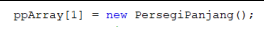

    Untuk melakukan instansiasi/ melakukan pemanggilan

3. Apa yang dimaksud dengan kode berikut ini:
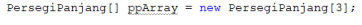
    
    deklarasi dan inisialisasi Array yang berisi object persegipanjang dan panjang nya  3

4. Apa yang dimaksud dengan kode berikut ini: 

    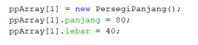
    
    membuat sebuah object perseegi panjang yang di tepatkan pada indek ke-1
    dan mengatur nilai panjang tersebut menjadi 80, dan lebar menjadi 40.

5. Mengapa class main dan juga class PersegiPanjang dipisahkan pada uji coba 3.2?

    pada class main digunakan untuk mengatur alur eksekusi utama program dan melakukan deklarasi dan class persegi panjang untuk mendefinisakn objek persegi panjang

## 3.3 Percobaan 2: Menerima Input Isian Array Menggunakan Looping
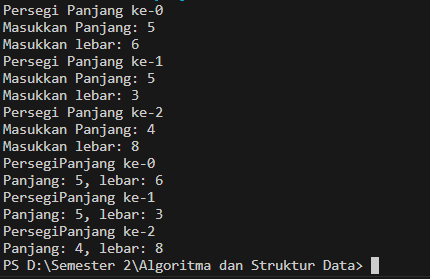

## 3.3.3 Pertanyaan 
1. Apakah array of object dapat diimplementasikan pada array 2 Dimensi?

    iya bisa diimplementasikan pada array 2 dimensi

2. Jika jawaban soal no satu iya, berikan contohnya! Jika tidak, jelaskan!

    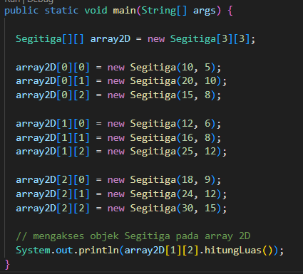

3. Jika diketahui terdapat class Persegi yang memiliki atribut sisi bertipe integer, maka kode 
dibawah ini akan memunculkan error saat dijalankan. Mengapa?

    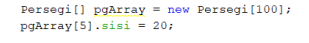

    karena pada saat membuat "pgArray" dari objek persegi hanya array nya yang di buat tapi namun elemen persegi tidak diinisialisasi sebagai objek "persegi"

4. Modifikasi kode program pada praktikum 3.3 agar length array menjadi inputan dengan Scanner!

    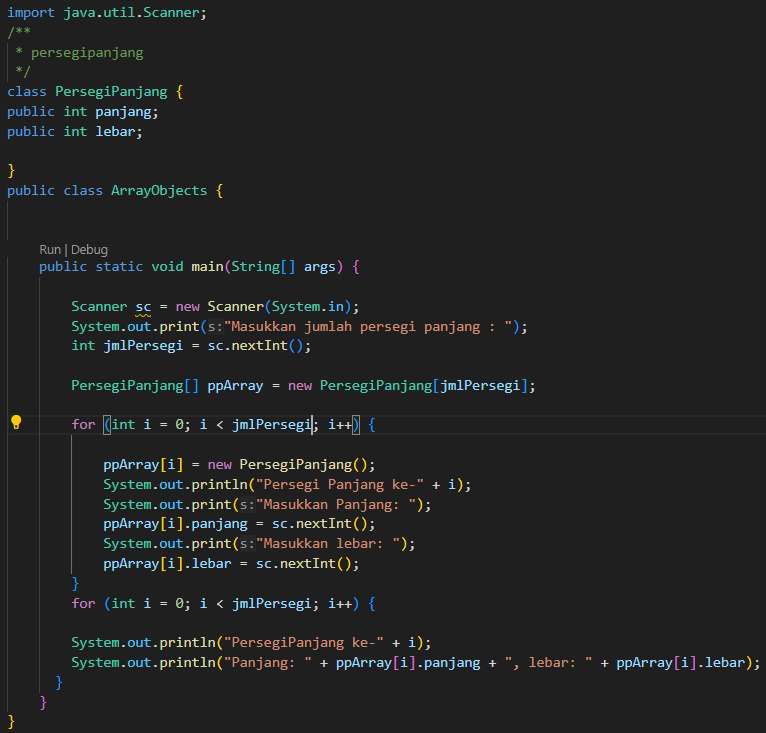

5. Apakah boleh Jika terjadi duplikasi instansiasi array of objek, misalkan saja instansiasi dilakukan 
pada ppArray[i] sekaligus ppArray[0]?Jelaskan !

    tidak boleh karena tidak dapat melakukan instansiasi array objek pada saat akses ke elemen array "ppArray[i]", ppArray[0] saat bersamaan. 

## 3.4 Percobaan 3: Penambahan Operasi Matematika di Dalam Method

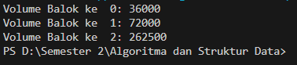

## 3.4.3 Pertanyaan
1. Dapatkah konstruktor berjumlah lebih dalam satu kelas? Jelaskan dengan contoh!
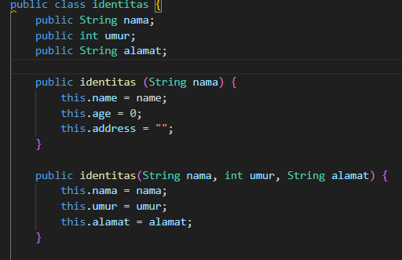
   
    Bisa karena dalam java dapat memwakili lebih dari satu kelas 

2. Jika diketahui terdapat class Segitiga seperti berikut ini:

    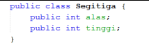

    Tambahkan konstruktor pada class Segitiga tersebut yang berisi parameter int a, int t
    yang masing-masing digunakan untuk mengisikan atribut alas dan tinggi.

    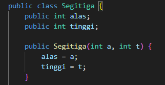  

3. Tambahkan method hitungLuas() dan hitungKeliling() pada class Segitiga
tersebut. Asumsi segitiga adalah segitiga siku-siku. (Hint: Anda dapat menggunakan bantuan 
library Math pada Java untuk mengkalkulasi sisi miring)

    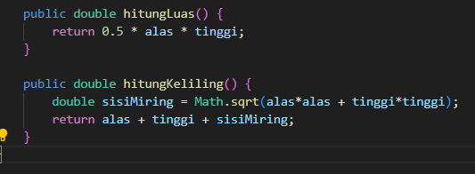

4. Pada fungsi main, buat array Segitiga sgArray yang berisi 4 elemen, isikan masing-masing 
atributnya sebagai berikut:
sgArray ke-0 alas: 10, tinggi: 4
sgArray ke-1 alas: 20, tinggi: 10
sgArray ke-2 alas: 15, tinggi: 6
sgArray ke-3 alas: 25, tinggi: 10

    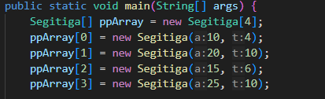

5. Kemudian menggunakan looping, cetak luas dan keliling dengan cara memanggil method
hitungLuas() dan hitungKeliling()

    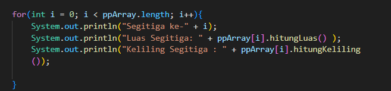

## 3.5 Latihan Praktikum

1. Buatlah program yang dapat menghitung luas permukaan dan volume bangun ruang kerucut, limas segi empat sama sisi, dan bola. Buatlah 3 (tiga) class sesuai dengan jumlah jenis bangun ruang. Buatlah satu main class untuk membuat array of objects yang menginputkan atribut atribut yang ada menggunakan konstruktor semua bangun ruang tersebut. Dengan ketentuan,

a. Buat looping untuk menginputkan masing-masing atributnya, kemudian tampilkan 
luas permukaan dan volume dari tiap jenis bangun ruang tersebut.

b. Pada kerucut, inputan untuk atribut hanya jari-jari dan sisi miring

c. Pada limas segi empat sama sisi, inputan untuk atribut hanya panjang sisi alas dan 
tinggi limas

d. Pada bola, inpuntan untuk atribut hanya jari-jari

2. Sebuah kampus membutuhkan program untuk menampilkan informasi mahasiswa berupa nama, 
nim, jenis kelamin dan juga IPK mahasiswa. Program dapat menerima input semua informasi 
tersebut, kemudian menampilkanya kembali ke user. Implementasikan program tersebut jika 
dimisalkan terdapat 3 data mahasiswa yang tersedia. Contoh output program:

Masukkan data mahasiswa ke- 1
Masukkan nama :Rina
Masukkan nim :1234567
Masukkan jenis kelamin :P
Masukkan IPK :3.5
Masukkan data mahasiswa ke- 2
Masukkan nama :Rio
Masukkan nim :7654321
Masukkan jenis kelamin :L
Masukkan IPK :4.0
Masukkan data mahasiswa ke- 3
Masukkan nama :Reza
Masukkan nim :8765398
Masukkan jenis kelamin :L
Masukkan IPK :3.8

Data Mahasiswa ke-1
nama : Rina
nim : 1234567
Jenis kelamin : P
Nilai IPK : 3.5
Data Mahasiswa ke-2
nama : Rio
nim : 7654321
Jenis kelamin : L
Nilai IPK : 4.0
Data Mahasiswa ke-3
nama : Reza
nim : 8765398
Jenis kelamin : L
Nilai IPK : 3.8

3. Modifikasi program Latihan no.2 di atas, sehingga bisa digunakan untuk menghitung rata-rata IPK, 
serta menampilkan data mahasiswa dengan IPK terbesar! (gunakan method untuk masing-masing 
proses tersebut)

## jawaban
1. Output
    
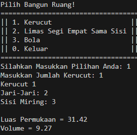

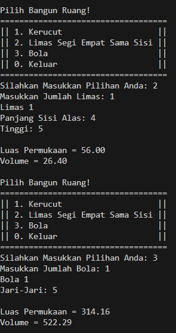

2.Output

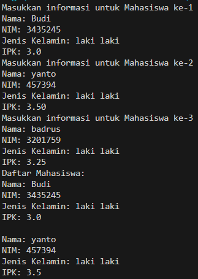

3.Output

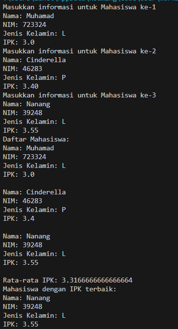