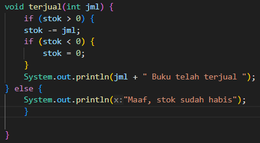
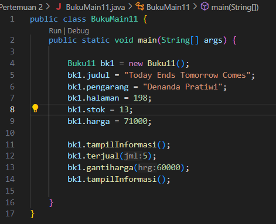
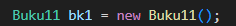
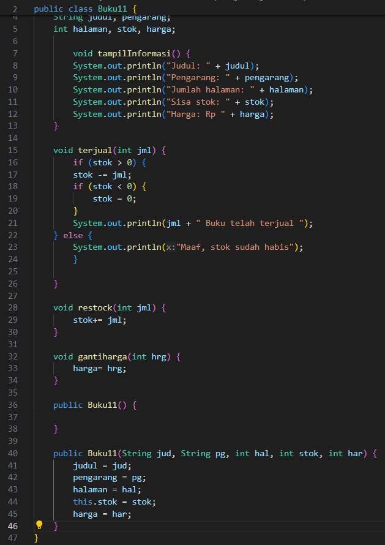
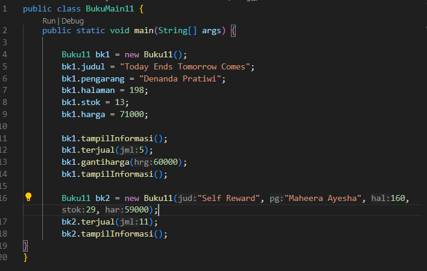
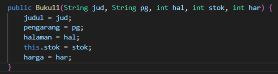
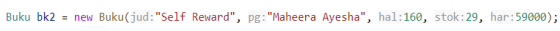
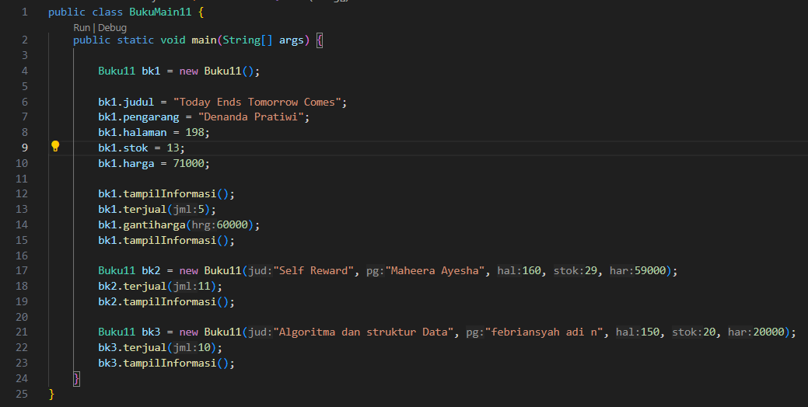
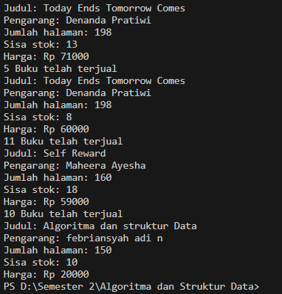
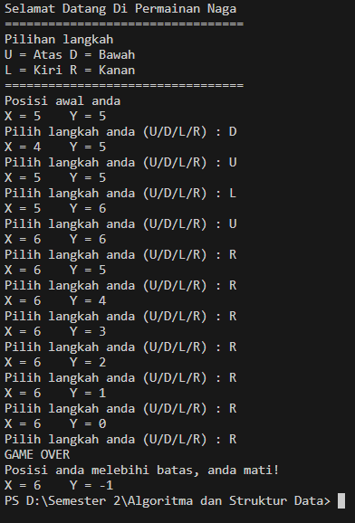

## Nama : febriansyah Adi N
## Nim : 2341720023
## Kelas :Ti 1H

## 2.1 Percobaan 1: Deklarasi Class, Atribut dan Method

## Pertayaan 2.1.2

## 2.1.3 Pertayaan 
1. Sebutkan dua karakteristik class atau object!

    Class memberikan definisi atau karakteristik dari objek yang akan dihasilkan.
    Class adalah sebuah cetak biru atau blueprint yang digunakan untuk membuat objek

    Object Object adalah instance atau representasi konkret dari sebuah class.
    Objek merupakan hasil dari implementasi class atau hasil produksi dari blueprint yang telah dibuat.

2. Perhatikan class Buku pada Praktikum 1 tersebut, ada berapa atribut yang dimiliki oleh class Buku? Sebutkan apa saja atributnya!
    
    Ada 5 atribut yaitu judul, pengarang, halaman, sisa stok, harga

3. Ada berapa method yang dimiliki oleh class tersebut? Sebutkan apa saja   methodnya!
    
     Ada 4 yaitu tampilinformasi, terjual, restock, gantiharga.

4. Perhatikan method terjual() yang terdapat di dalam class Buku. Modifikasi isi method tersebut sehingga proses pengurangan hanya dapat dilakukan jika stok masih ada (lebih besar dari 0)!

5. Menurut Anda, mengapa method restock() mempunyai satu parameter berupa bilangan int?

    karena mewakili jumlah buku yang akan di tambahkan kembali ke stok

6. Commit dan push kode program ke Github

## 2.2 Percobaan 2: Instansiasi Object, serta Mengakses Atribut dan Method

## 2.2.3 Pertayaan
1. Pada class BukuMain, tunjukkan baris kode program yang digunakan untuk proses instansiasi! Apa nama object yang dihasilkan?

      Nama objek yang dihasilkan yaitu bk1

2. Bagaimana cara mengakses atribut dan method dari suatu objek?

    Akses atribut dengandengan menggunakan nama objek dan diikuti operator titik (".") dan nama atribut tersebut

    Akses method dengan menggunakan nama objek diikuti oleh operator titik (".") dan nama method tersebut

3. Mengapa hasil output pemanggilan method tampilInformasi() pertama dan kedua berbeda?

    karena ada perubahan yang terjadi pada objek bk1 antara pemanggilan tersebut.
    pemangilan pertama output mencerminkan informasi dari objek bk1 sebelum ada perubahan
    pemanggilan kedua yaitu terdapat perubahan terjual buku sebanyak 5, dan perubahan harga pada buku oleh karena itu pemanggilan tampilInformasi kedua mencatat perubahan perubahan itu

## 2.3 Percobaan 3: Membuat Kontruktor
pada class Buku11

pada Bukumain11

## 2.3.3 Pertayaan 
1. Pada class Buku di Percobaan 3, tunjukkan baris kode program yang digunakan untuk mendeklarasikan konstruktor berparameter!
    

2. Perhatikan class BukuMain. Apa sebenarnya yang dilakukan pada baris program berikut?
    

    membuat objek baru pada Bukumain dengan menggunakan kontruktor berparameter. Objek yang di buat di simpan pada variabel bk2.

3. Hapus konstruktor default pada class Buku, kemudian compile dan run program. Bagaimana hasilnya? Jelaskan mengapa hasilnya demikian!

    akan error karena kontruktor pada class buku tersebut digunakan untuk inisialisasi

4. Setelah melakukan instansiasi object, apakah method di dalam class Buku harus diakses secara berurutan? Jelaskan alasannya!
    
    tidak harus berurutan karena sebuah class bersifat berurutan satu sama lain 

5. Buat object baru dengan nama buku<NamaMahasiswa> menggunakan konstruktor 
berparameter dari class Buku!

6. Commit dan push kode program ke Github

## 2.4 Latihan Praktikum

1. 

2.
