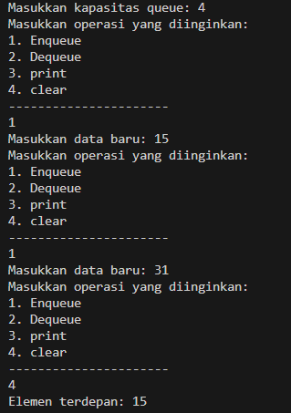
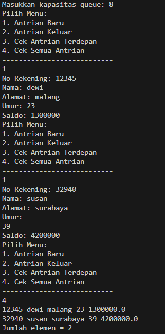
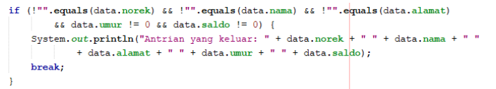
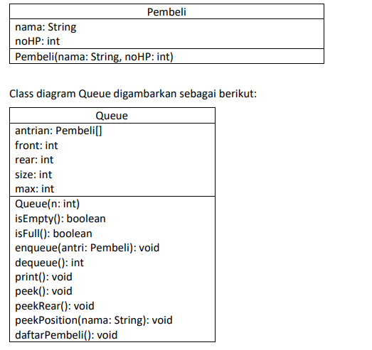

## Laporan praktikum joobsheet 10

## 10.2 Praktikum 1

## 10.2.2 Verifikasi Hasil Percobaan

## 10.2.3 Pertanyaan
1. Pada konstruktor, mengapa nilai awal atribut front dan rear bernilai -1, sementara atribut size 
bernilai 0?
2. Pada method Enqueue, jelaskan maksud dan kegunaan dari potongan kode berikut!
3. Pada method Dequeue, jelaskan maksud dan kegunaan dari potongan kode berikut!
4. Pada method print, mengapa pada proses perulangan variabel i tidak dimulai dari 0 (int i=0), 
melainkan int i=front?
5. Perhatikan kembali method print, jelaskan maksud dari potongan kode berikut!
6. Tunjukkan potongan kode program yang merupakan queue overflow!
7. Pada saat terjadi queue overflow dan queue underflow, program tersebut tetap dapat berjalan 
dan hanya menampilkan teks informasi. Lakukan modifikasi program sehingga pada saat terjadi 
queue overflow dan queue underflow, program dihentikan!

## 10.3 Praktikum 2

## 10.3.2 Verifikasi Hasil Percobaan

## 10.3.3 Pertanyaan
1. Pada class QueueMain, jelaskan fungsi IF pada potongan kode program berikut!

2. Lakukan modifikasi program dengan menambahkan method baru bernama peekRear pada class 
Queue yang digunakan untuk mengecek antrian yang berada di posisi belakang! Tambahkan pula 
daftar menu 5. Cek Antrian paling belakang pada class QueueMain sehingga method peekRear
dapat dipanggil!

## 10.4 Tugas
1. Buatlah program antrian untuk mengilustasikan pesanan disebuah warung. Ketika seorang 
pembeli akan mengantri, maka dia harus mendaftarkan nama, dan nomor HP seperti yang 
digambarkan pada Class diagram berikut

Keterangan:
• Method create(), isEmpty(), isFull(), enqueue(), dequeue() dan print(), kegunaannya sama seperti 
yang telah dibuat pada Praktikum
• Method peek(): digunakan untuk menampilkan data Pembeli yang berada di posisi antrian paling 
depan
• Method peekRear(): digunakan untuk menampilkan data Pembeli yang berada di posisi antrian 
paling belakang
• Method peekPosition(): digunakan untuk menampilkan seorang pembeli (berdasarkan nama)
posisi antrian ke berapa
• Method daftarPembeli(): digunakan untuk menampilkan data seluruh pembeli