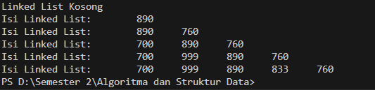
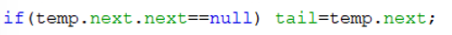
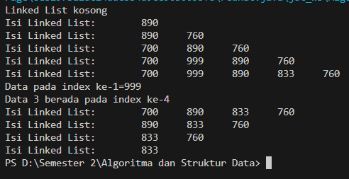
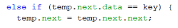
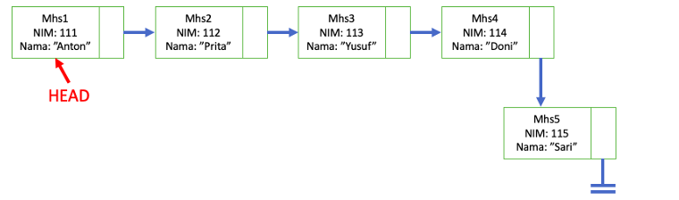
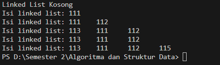
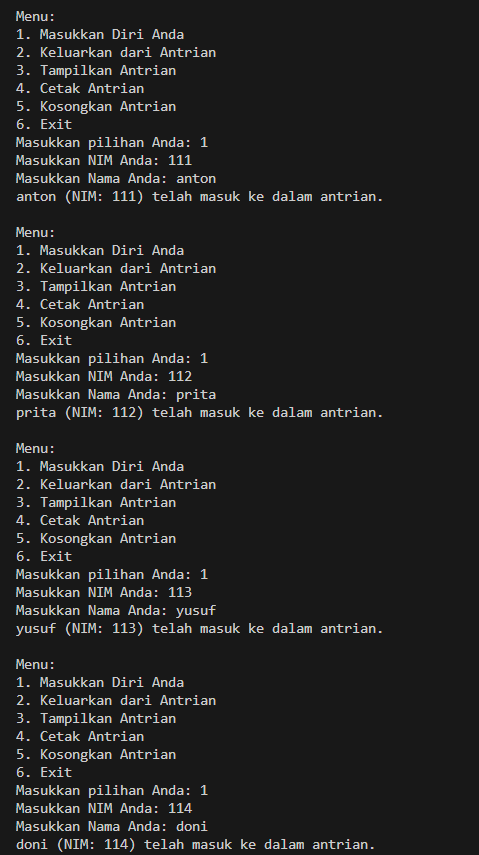
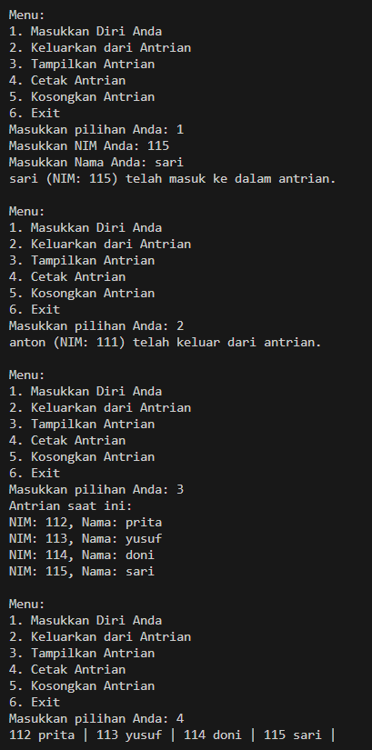

## Laporan praktikum Jobsheet 12

## 2.1.1 Verifikasi Hasil Percobaan 

## 2.1.2 Pertayaan 
1. Mengapa hasil compile kode program di baris pertama menghasilkan “Linked List Kosong”?
    karena pada baris pertama belum di masukkan nilai
2. Jelaskan kegunaan variable temp secara umum pada setiap method!
    variable temp digunakan sebagai node sementara untuk melakukan operasi pada setiap node pada linked list, seperti menemukan node tertentu, menambahkan node baru setelah node tertentu, atau melakukan iterasi pada setiap node.
3. Perhatikan class SingleLinkedList, pada method insertAt Jelaskan kegunaan kode berikut

    jadi, baris kode if (temp.next.next == null) { tail = temp.next; } bertanggung jawab untuk mempertahankan referensi tail ketika sebuah node baru dimasukkan di akhir linked list. Kode ini memastikan bahwa referensi tail selalu menunjuk ke node terakhir, sehingga memungkinkan operasi yang efisien yang melibatkan akhir dari linked list.

## 2.2 Modifikasi Elemen pada Single Linked List

## 2.2.2 Verifikasi Hasil Percobaan

## 2.2.3 Pertanyaan
1. Mengapa digunakan keyword break pada fungsi remove? Jelaskan!
    Break digunakan untuk keluar dari looping setelah node dengan kunci yang cocok ditemukan dan dihapus. Jika tidak menggunakan break iterasi akan terus dilanjutkan meskipun node yang diinginkan sudah dihapus.

2. Jelaskan kegunaan kode dibawah pada method remove
    
    
    digunakan untuk memeriksa data selanjutnya linked list sama dengan parameter key, jika di ada maka selanjutnya dihapus dari node
    
## 3 Tugas
1. 
Implementasikan ilustrasi Linked List Berikut. Gunakan 4 macam penambahan data yang telah dipelajari sebelumnya untuk menginputkan data.

2. Buatlah implementasi program antrian layanan unit kemahasiswaan sesuai dengan kondisi yang ditunjukkan pada soal nomor 1! Ketentuan 

    a. Implementasi antrian menggunakan Queue berbasis Linked List! 

    b. Program merupakan proyek baru, bukan modifikasi dari soal nomor 1! 

