## Pertemuan 12 Jobsheet 10

## 12.2 Kegiatan Praktikum 1 
## 12.2.2 Verifikasi Hasil Percobaan
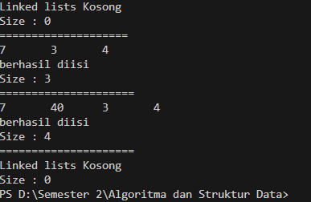

## 12.2.3 Pertanyaan Percobaan 
1. Jelaskan perbedaan antara single linked list dengan double linked lists!
    single linked list hanya node node yang saling berhubungan satu sama lain sedangkan double linked lists memiliki dua buah pointer yaitu pointer next dan prev

2. Perhatikan class Node, di dalamnya terdapat atribut next dan prev. Untuk apakah atribut tersebut? 
    atribut next untuk menunjuk pada node setelahnya dan atribut prev untuk menunjuk pada node sebelumnya

3. Perhatikan konstruktor pada class DoubleLinkedLists. Apa kegunaan inisialisasi atribut head dan size seperti pada gambar berikut ini?

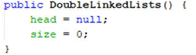
nilai awal dari head dan size belum di isi

4. Pada method addFirst(), kenapa dalam pembuatan object dari konstruktor class Node prev dianggap sama dengan null? 
Node newNode = new Node(null, item, head);
    karena node baru yang akan ditambahkan akan menjadi node pertama(head) 

5. Perhatikan pada method addFirst().  Apakah arti statement head.prev = newNode ? 
    statement tersebut diarti kan bahwa membuat data baru di sebelum head

6. Perhatikan isi method addLast(), apa arti dari pembuatan object Node dengan mengisikan 
parameter prev dengan current, dan next dengan null? Node newNode = new Node(current, item, null);  
    karena prev akan mengambil prev sebelumnya dan next akan menjadi null karena setelah node tersebut terakhir

7. Pada method add(), terdapat potongan kode program sebagai berikut:
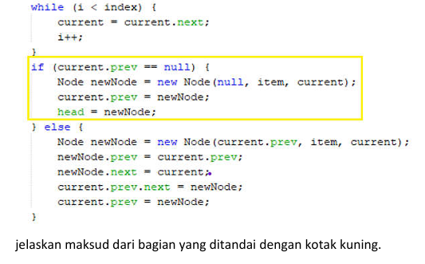

    jadi menambahkan node baru ke daftar ketika masih kosong node tersebt akan menjadi node pertama dan head akan menunjuk ke node baru

## 12.3 Kegiatan Praktikum 2 
## 12.3.2 Verifikasi Hasil Percobaan
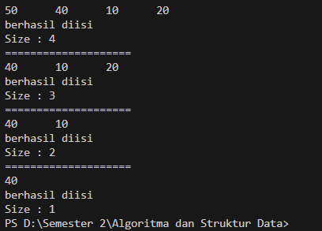
## 12.3.3 Pertanyaan Percobaan
1. Apakah maksud statement berikut pada method removeFirst()? 
    head = head.next; 
    head.prev = null; 

    mengubah head agar menunjuk ke node berikutnya dan setelah head di ubah menunjuk ke node berikutnya menetapkan head dan prev bernilai null 
2. Bagaimana cara mendeteksi posisi data ada pada bagian akhir pada method removeLast()? 
    dilakukan perulangan while  dengan kondisi current.next.next != null perulangan ini akan terus sampai sama null untuk memutuskan dengan node
    terakhir 

3. Jelaskan alasan potongan kode program di bawah ini tidak cocok untuk perintah remove! 
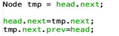

        Karena nilai dari tmpnya head.next. Karena hal itu kita jadi tidak bisa mengganti node headnya atau memasukkan node baru pada index 0.

4. Jelaskan fungsi kode program berikut ini pada fungsi remove!
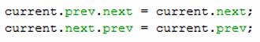

    pointer next dari node sebelum current akan menunjuk pada node setelah current dan pointer prev dari node setelah current akan menunjuk pada node sebelum current.

## 12.4 Kegiatan Praktikum 3 
## 12.4.2 Verifikasi Hasil Percobaan

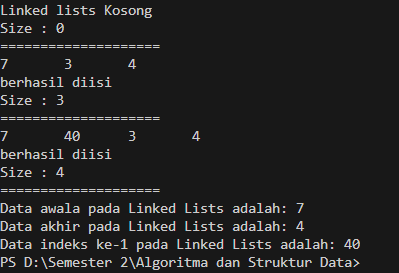

## 12.4.3 Pertanyaan Percobaan 
1. Jelaskan method size() pada class DoubleLinkedLists! 

    untuk mengembalikan  nilai dari size

2. Jelaskan cara mengatur indeks pada double linked lists supaya dapat dimulai dari indeks ke- 1! 

    dengam mengatur iterasi dan mengubah pointer pada method add() dan get() untuk memulai dari indek -1 dan melakukan pnegecekan jika i sama dengan indek

3. Jelaskan perbedaan karakteristik fungsi Add pada Double Linked Lists dan Single Linked Lists!  

    Jika Single Linked Lists hanya merubah next saja karena Linked Listnya satu arah Sedangkan Double Linked Lists merubah next dan previous karena Linked Listsnya 2 arah.

4. Jelaskan perbedaan logika dari kedua kode program di bawah ini!
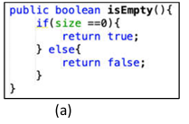
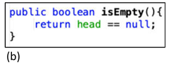

    Gambar a melakukan pengecekan pada atribut size menggunakan algoritma if-else sedangkan gambar b melakukan pengecekan secara langsung pada atribut head.

## 12.5 Tugas Praktikum
1. Buat program antrian vaksinasi menggunakan queue berbasis double linked list sesuai ilustrasi 
dan menu di bawah ini! (counter jumlah antrian tersisa di menu cetak(3) dan data orang yang 
telah divaksinasi di menu Hapus Data(2) harus ada) 

Menu awal penambahan Data

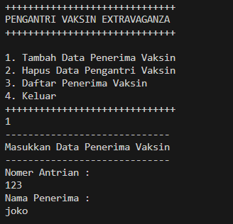

Cetak Data

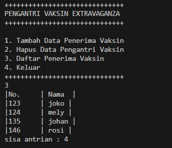

Hapus Data

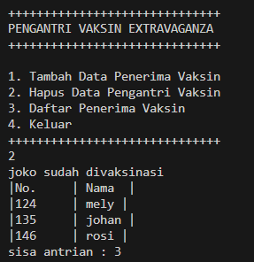

2. Buatlah program daftar film yang terdiri dari id, judul dan rating menggunakan double linked lists, bentuk program memiliki fitur pencarian melalui ID Film dan pengurutan Rating secara descending. Class Film wajib diimplementasikan dalam soal ini.

tambah data awal

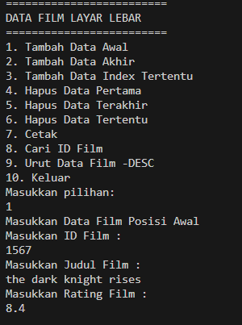

tambah data posisi akhir

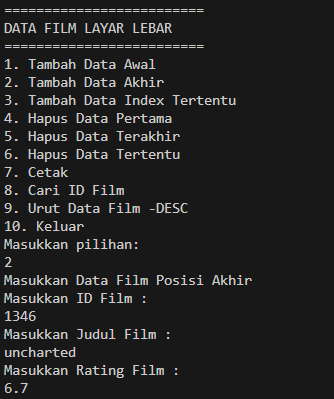

tambah data pada indek tertentu

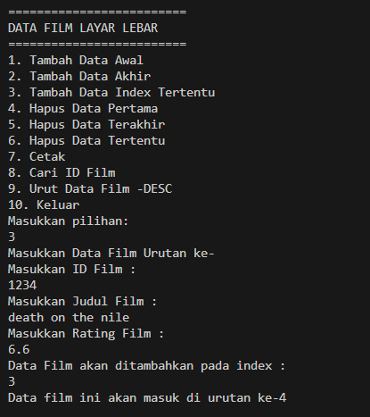

cetak

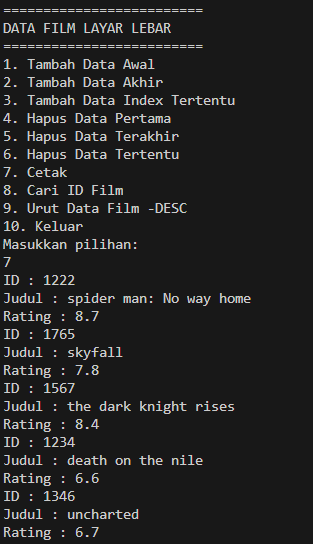

cari film

urutan data rating secara descending

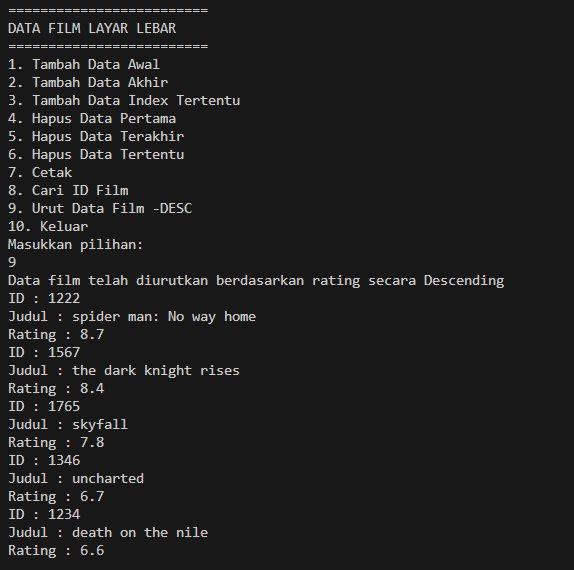