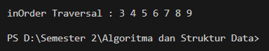

## Jobsheet 13 Tree

## 13.2 Kegiatan Praktikum 1 Implementasi Binary Search Tree menggunakan Linked List

## 13.2.1 Percobaan 1


## 13.2.2 Pertanyaan Percobaan 1
1. Mengapa dalam binary search tree proses pencarian data bisa lebih efektif dilakukan dibanding  binary tree biasa? 
    setiap node memiliki aturan khusus di mana nilai node di sebelah kiri lebih kecil daripada nilai node saat ini dan nilai node di sebelah kanan lebih besar daripada nilai node saat ini. Struktur ini memungkinkan pencarian data lebih efektif karena memanfaatkan sifat terurut dari sebuah  pohon.

    
2. Untuk apakah di class Node, kegunaan dari atribut left dan right? 
    Atribut left: Menunjuk ke anak kiri, yang berisi node dengan nilai lebih kecil dari nilai node saat ini.
    Atribut right: Menunjuk ke anak kanan, yang berisi node dengan nilai lebih besar dari nilai node saat ini.

3. a. Untuk apakah kegunaan dari atribut root di dalam class BinaryTree? 
    Menandai titik awal dari sebuah pohon biner,seperti sistem penambahan,pencarian, pengahapusan dimulai dari node root, dan tanpa root kita bisa mengakses atau mengelola node node lainnya

    b. Ketika objek tree pertama kali dibuat, apakah nilai dari root? 
    bernilai null
4. Ketika tree masih kosong, dan akan ditambahkan sebuah node baru, proses apa yang akan terjadi? 
        sebuah node baru akan dibuat dengan nilai yang di berikan sekaligus di jadikan root yang baru dari tree yang tidak memiliki root dan node baru akan memiliki node baru yang memiliki atribut left dan right 

5. Perhatikan method add(), di dalamnya terdapat baris program seperti di bawah ini. Jelaskan secara detil untuk apa baris program tersebut? 
``` java
if(data<current.data){ 
    if(current.left!=null){ 
        current = current.left; 
    }else{ 
    current.left = new Node(data); 
    break; 
    } 
} 
```
    if(data<current.data) - Baris ini memeriksa apakah nilai data yang akan dimasukkan lebih kecil dari nilai current.data (data dari node saat ini).
    if(current.left!=null) - Jika nilai data lebih kecil dari current.data, program akan memeriksa apakah node saat ini memiliki anak di sisi kiri (left child). Jika memiliki anak di sisi kiri, maka:
    current = current.left - Program akan mengubah referensi current menjadi node anak di sisi kiri. Hal ini dilakukan untuk melanjutkan pencarian tempat yang tepat untuk menyisipkan node baru di bawah subtree sebelah kiri.
    else - Jika node saat ini tidak memiliki anak di sisi kiri, maka:
    current.left = new Node(data) - Program akan membuat node baru dengan nilai data dan menetapkannya sebagai anak di sisi kiri dari node current.
    break - Setelah node baru berhasil disisipkan, program akan keluar dari perulangan atau rekursi yang digunakan dalam proses penyisipan node.

## 13.3 Kegiatan Praktikum 2  Implementasi binary tree dengan array

## 13.3.1 Tahapan Percobaan 


## 13.3.2 Pertanyaan Percobaan 
1. Apakah kegunaan dari atribut data dan idxLast yang ada di class BinaryTreeArray? 
    untuk melacak indek terakhir yang diisi dalam array data, dan menyimpan node terakhir yang ditambahkan


2. Apakah kegunaan dari method populateData()? 
    mengisi atribut data array yang diberikan  dan mengisi atribut idxlast dengan index yang terakhir

3. Apakah kegunaan dari method traverseInOrder()? 
    digunakan untuk mencetak dan mengakses nilai nilai node dalam binary tree yang tersimpan dalam array data 

4. Jika suatu node binary tree disimpan dalam array indeks 2, maka di indeks berapakah posisi left child dan rigth child masin-masing? 
    node binary tree disimpan dalam array indeks 2, maka left child berada pada indeks 5, dan right child berada pada indeks 6.

5. Apa kegunaan statement int idxLast = 6 pada praktikum 2 percobaan nomor 4? 
    digunakan untuk menginisialisasi nilai variabel idxLast yang menunjukkan indeks terakhir dalam array data yang berisi nilai node dari binary tree.

## 13.4 Tugas Praktikum 
1. Buat method di dalam class BinaryTree yang akan menambahkan node dengan cara 
rekursif. 
    

2. Buat method di dalam class BinaryTree untuk menampilkan nilai paling kecil dan yang 
paling besar yang ada di dalam tree. 


3. Buat method di dalam class BinaryTree untuk menampilkan data yang ada di leaf. 


4. Buat method di dalam class BinaryTree untuk menampilkan berapa jumlah leaf yang ada 
di dalam tree. 

5. Modifikasi class BinaryTreeArray, dan tambahkan :  
• method add(int data) untuk memasukan data ke dalam tree  


• method traversePreOrder() dan traversePostOrder() 
