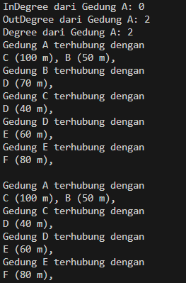
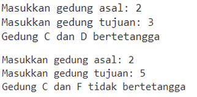
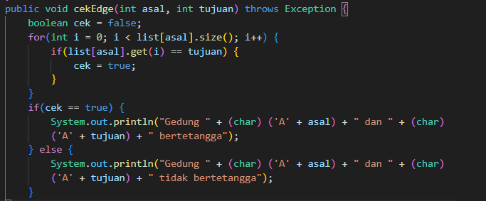
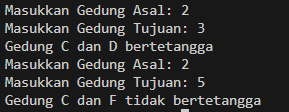
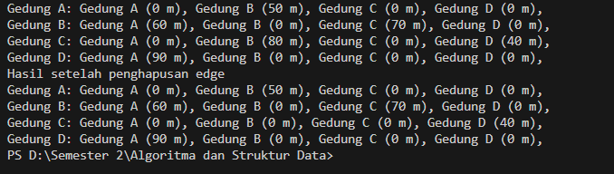
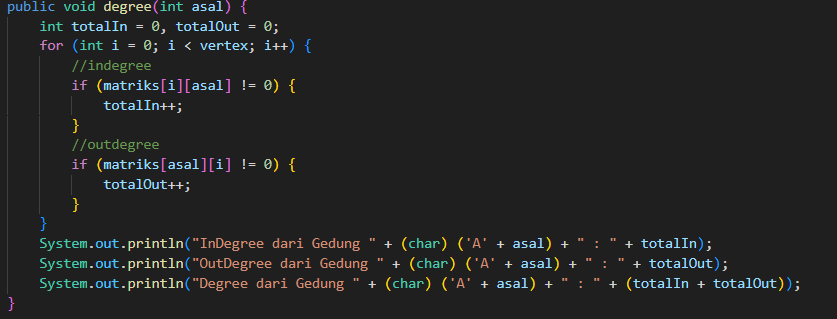
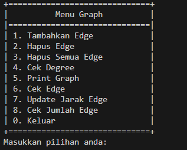
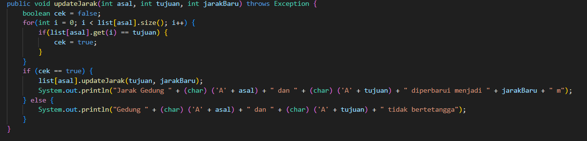
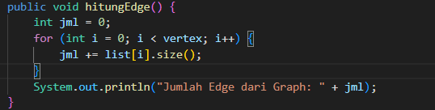

## JOBSHEET 15 Graph
## 2.1  Percobaan 1: Implementasi Graph menggunakan Linked List
## 2.1.2 Verifikasi Hasil Percobaan


## 2.1.3 Pertanyaan
1. Perbaiki kode program Anda apabila terdapat error atau hasil kompilasi kode tidak sesuai! 
2. Pada class Graph, terdapat atribut list[] bertipe DoubleLinkedList. Sebutkan tujuan pembuatan variabel tersebut! 

    Penggunaan array list[] untuk menyimpan informasi tetangga untuk setiap vertex secara terpisah. Indeks dari array list mewakili nomor vertex, dan nilai pada indeks tersebut adalah DoubleLinkedList yang berisi daftar tetangga untuk vertex yang bersangkutan.

3. Jelaskan alur kerja dari method removeEdge! 

    menerima dua parameter asal dan tujuan, melakukan iterasi melalui semua vertex, pada saat iterasi jika vertex i sama dengan tujuan maka kode akan menghapus tujuan dari daftar vertex asal  menggunakan remove(tujuan) pada doublelinkedlist yang menyimpan tetangga vertex asal

4. Apakah alasan pemanggilan method addFirst() untuk menambahkan data, bukan method add jenis lain saat digunakan pada method addEdge pada class Graph? 

    untuk memastikan penambahan data baru yang cepat dan efisien tanpa memerlukan traversal tambahan

5. Modifikasi kode program sehingga dapat dilakukan pengecekan apakah terdapat jalur antara suatu node dengan node lainnya, seperti contoh berikut (Anda dapat memanfaatkan Scanner)


Class Graph


Hasil Run


    
## 2.2 Percobaan 2: Implementasi Graph menggunakan Matriks
## 2.2.2 Verifikasi Hasil Percobaan 


## 2.2.3 Pertanyaan
1. Perbaiki kode program Anda apabila terdapat error atau hasil kompilasi kode tidak sesuai! 

2. Apa jenis graph yang digunakan pada Percobaan 2? 
    graph matriks

3. Apa maksud dari dua baris kode berikut? 
``` java
    gdg.makeEdge(1, 2, 70);
    gdg.makeEdge(2, 1, 80);
```
    Membuat edge dari gedung B ke gedung C dengan jarak 70m dan gedung C ke gedung B dengan jarak 80m

4. Modifikasi kode program sehingga terdapat method untuk menghitung degree, termasuk inDegree dan outDegree!



## 3. Latihan Praktikum
1. Modifikasi kode program pada class GraphMain sehingga terdapat menu program yang bersifat 
dinamis, setidaknya terdiri dari: 
a Add Edge 
b Remove Edge 
c Degree 
d Print Graph 
e Cek Edge 
Pengguna dapat memilih menu program melalui input Scanner 



2. Tambahkan method updateJarak pada Percobaan 1 yang digunakan untuk mengubah jarak 
antara dua node asal dan tujuan! 



3. Tambahkan method hitungEdge untuk menghitung banyaknya edge yang terdapat di dalam graf!

