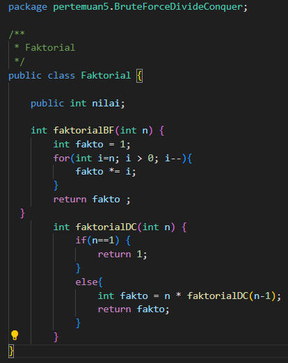
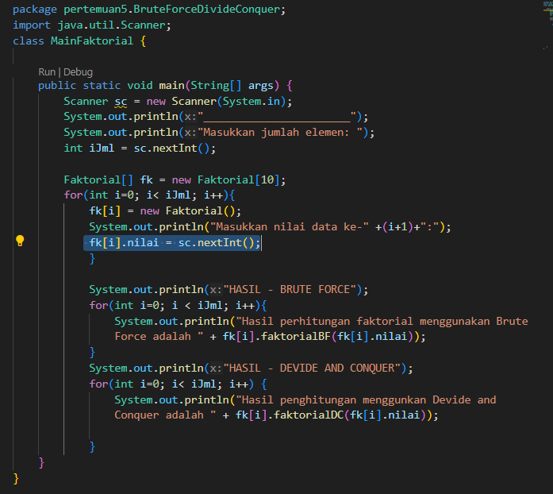
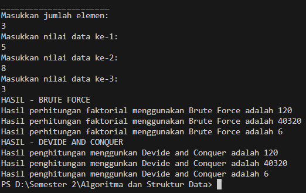

Nama : Febriansyah Adi N
Kelas : 1H
Nim : 2341720023
## Pertemuan 4
## 4.2 Menghitung nilai Faktorial dengan Algoritma Brute Force dan Devide and Conquer

## 4.2.2 Verifikasi Hasil Percobaan 

## 4.2.3 Pertayaan 
1. Pada base line Algoritma Divide Conquer untuk melakukan pencarian nilai faktorial, jelaskan 
perbedaan bagian kode pada penggunaan if dan else!
2. Apakah memungkinkan perulangan pada method faktorialBF() dirubah selain menggunakan 
for?Buktikan!
3. Jelaskan perbedaan antara fakto *= i; dan int fakto = n * faktorialDC(n-1); !
## 4.3 Menghitung Hasil Pangkat dengan Algoritma Brute Force dan Dividee and Conquer
