Nama : Febriansyah Adi N
Kelas : 1H
Nim : 2341720023
## Pertemuan 4
## 4.2 Menghitung nilai Faktorial dengan Algoritma Brute Force dan Devide and Conquer
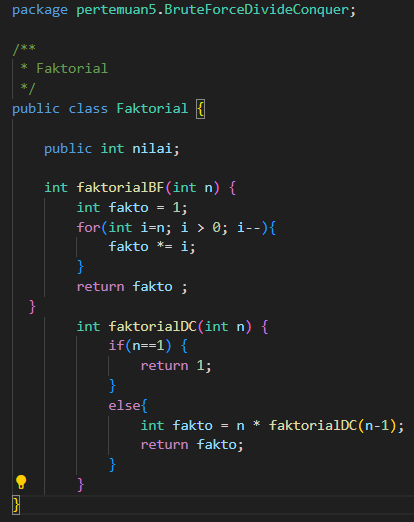

## 4.2.2 Verifikasi Hasil Percobaan 

## 4.2.3 Pertayaan 
1. Pada base line Algoritma Divide Conquer untuk melakukan pencarian nilai faktorial, jelaskan 

perbedaan bagian kode pada penggunaan if dan else!
IF : kode pada IF digunakan untuk menangani jika nilai yang di faktorialkan adalah 0 atau 1. Jika nilai yang difaktorialkan 0 atau 1 maka akan memberi nilai return 1
ELSE : kode pada ELSE merupakan pengulangan rekursif untuk menghitung n-faktorial. Dengan cara mengisi method faktorialDC() dengan (n-1) secara terus menerus sampai iterasi berakhir (saat hasil n-1 bernilai 1)

2. Apakah memungkinkan perulangan pada method faktorialBF() dirubah selain menggunakan 
for?Buktikan!

bisa dengan menggunakan for while
   int fakto = 1;
        int i = 1;

        while (i <= n) {
            fakto *= i;
            i++;
        }
        return fakto ;
3. Jelaskan perbedaan antara fakto *= i; dan int fakto = n * faktorialDC(n-1); !

Pada fakto *= i;, kode menggunakan perkalian untuk menghitung nilai faktorial. Setiap iterasi, fakto mengalikan nilai fakto itu sendiri dengan nilai i increment dan berhenti sampai syarat terpenuhi. Pada int fakto = n * faktorialDC(n-1);, kode menggunakan rekursi untuk menghitung nilai faktorial. Setiap perulangan, nilai fakto berisi nilai n yang dikalikan dengan faktorialDC dari n-1.
## 4.3 Menghitung Hasil Pangkat dengan Algoritma Brute Force dan Dividee and Conquer
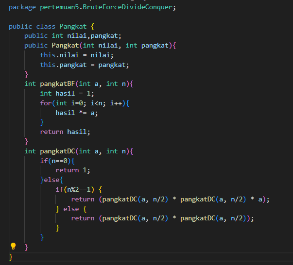
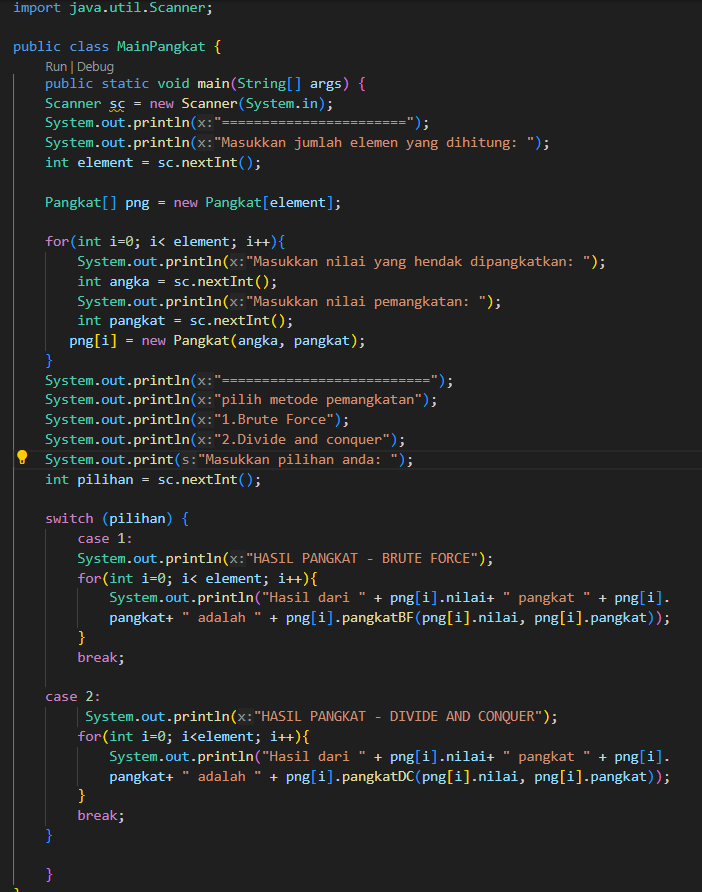
## 4.3.2 Verifikasi hasil percobaan
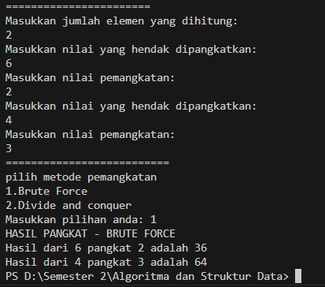
## 4.3.3 Pertayaan
1. Jelaskan mengenai perbedaan 2 method yang dibuat yaitu PangkatBF() dan PangkatDC()!

pangkatBF : pada pangkat ini bilangan akan dihitung dengan mengalihkan dengan dirinya sendiri sebanyak pangkat yang diinginkan 
pangkatDC : pada pangkat ini perhitungan pangkat menjadi dua bagian untuk n/2 dan laninya n-n/2 dan hasilnya di kaitkan kembali jika n bilangan ganjil maka satu bagian tambahan a jug akan di kalikan pada tahap terakhir  

2. Apakah tahap combine sudah termasuk dalam kode tersebut?Tunjukkan!
sudah
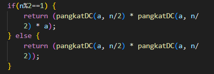
3. Modifikasi kode program tersebut, anggap proses pengisian atribut dilakukan dengan 
konstruktor.
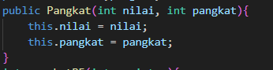
4. Tambahkan menu agar salah satu method yang terpilih saja yang akan dijalankan menggunakan 
switch-case!

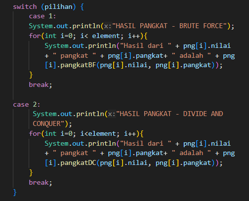
## 4.4 Menghitung Sum Array dengan Algoritma Brute Force dan Divide and Conquer
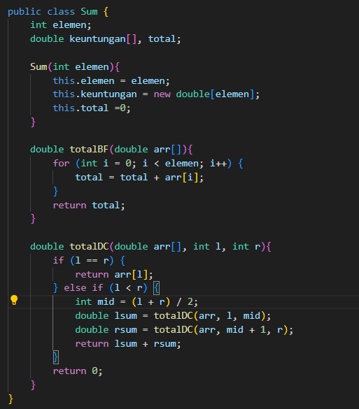
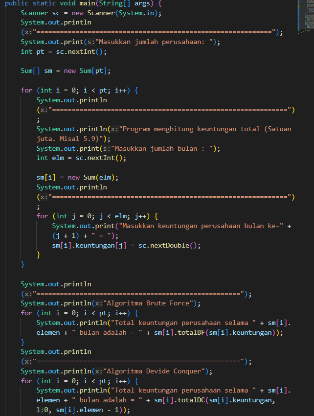
## 4.4.2 Verifikasi Hasil Percobaan
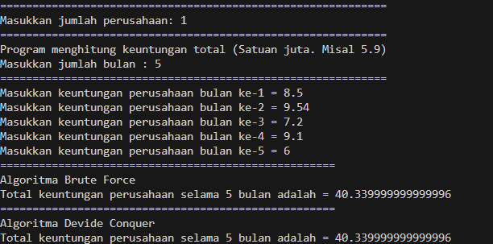
## 4.4.3 Pertayaan
1. Mengapa terdapat formulasi return value berikut?Jelaskan!

return lsum + rsum + arr[mid]; digunakan untuk mengembalikan total nilai dengan menjumlah nilai di bagian kiri (lsum), bagian kanan (rsum), dan elemen tengah (mid) dari array tersebut.

2. Kenapa dibutuhkan variable mid pada method TotalDC()?

mid dibutuhkan untuk menandai posisi tengah array kemudain membagi array menjadi dua bagian yang lebih kecil, yaitu bagian kiri dan bagian kanan pada setiap pengulangan rekursif. Setela itu, setiap bagian dari array dihitung secara terpisah dan digabungkan lagi di akhir proses.

3. Program perhitungan keuntungan suatu perusahaan ini hanya untuk satu perusahaan saja. 
Bagaimana cara menghitung sekaligus keuntungan beberapa bulan untuk beberapa 
perusahaan.(Setiap perusahaan bisa saja memiliki jumlah bulan berbeda-beda)? Buktikan 
dengan program!

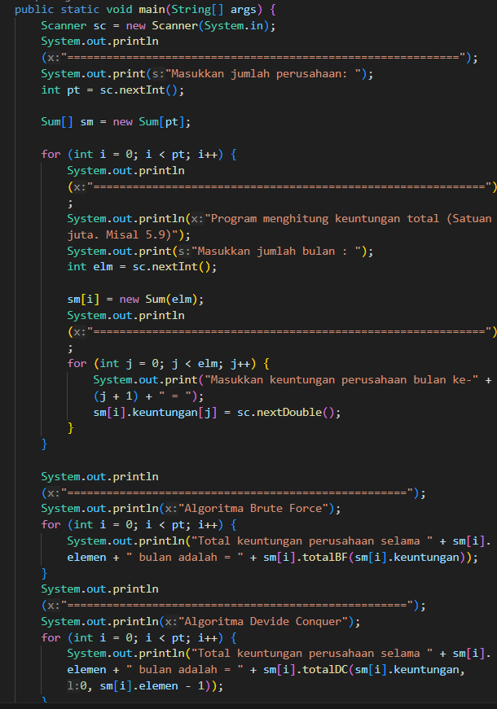

## 4.5 Latihan Praktikum
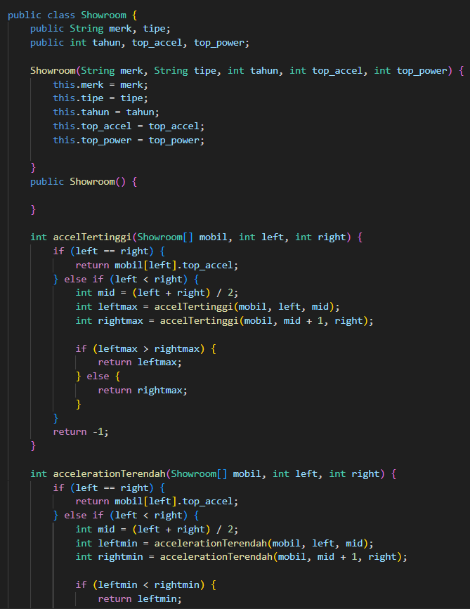
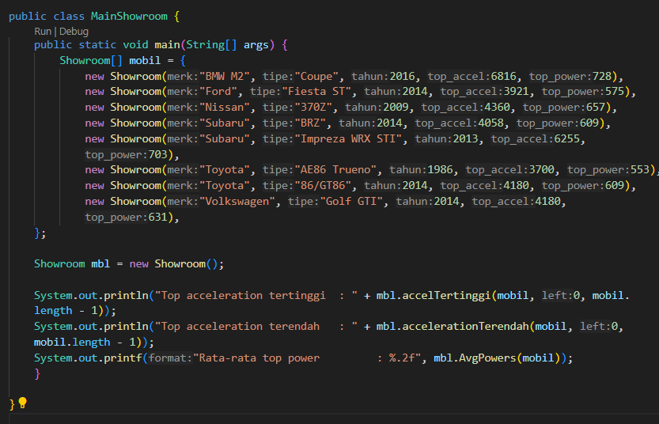