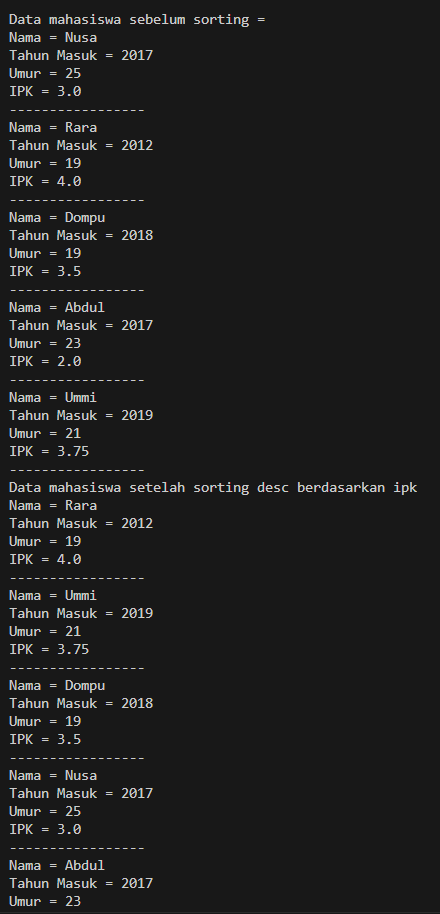
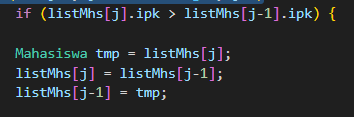
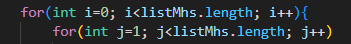
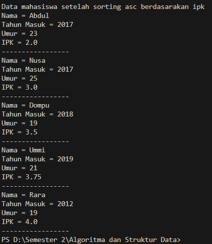
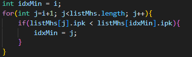

## 5.2 Mengurutkan Data Mahasiswa Berdasarkan IPK Menggunakan Bubble Sort
## 5.2.2 Verifikasi Hasil Percobaan

## 5.2.3 Pertayaan
1. Terdapat di method apakah proses bubble sort?

    DaftarMahasiswaBerprestasi
2. Di dalam method bubbleSort(), terdapat baris program seperti di bawah ini:

untuk apakah proses tersebut?

kondisi if(listMhs[j].ipk > list.Mhs[j-1].ipk) untuk mengecek apakah nilai  ipk pada j lebih besar dari ipk pada j-1
jika kondisi tersebut terpenuhi maka akan terjadi pertukaran pada j dengan j-1
nilai pada j akan disimpan pada variabel tmp dan nilai pada j-1 akan berganti ke j

3. Perhatikan perulangan di dalam bubbleSort() di bawah ini:

a. Apakah perbedaan antara kegunaan perulangan i dan perulangan j?
perulangan i untuk mengakses elemen dengan indek i dari listMhs sedangkan perulangan j mengakses perulangan dengan indek j dari listMhs

b. Mengapa syarat dari perulangan i adalah i<listMhs.length-1 ?
karena indeks array dimulai dari 0, dan indeks terakhir dari array dengan n elemen adalah n - 1. Jadi, listMhs.length - 1 akan memberikan indeks elemen terakhir array.

c. Mengapa syarat dari perulangan j adalah j<listMhs.length-i ?
untuk memastikan bahwa inner loop hanya mengulang pada bagian dari array yang belum disortir.

d. Jika banyak data di dalam listMhs adalah 50, maka berapakali perulangan i akan berlangsung? Dan ada berapa Tahap bubble sort yang ditempuh?
akan dilakukan 49 kali (dari 0 hingga 48, karena syaratnya adalah i < listMhs.length - 1).

## 5.3 Mengurutkan Data Mahasiswa Berdasarkan IPK Menggunakan Selection Sort
## 5.3.2. Verifikasi Hasil Percobaan

## 5.3.3 Pertayaan 
1. Di dalam method selection sort, terdapat baris program seperti di bawah ini:

untuk apakah proses tersebut,jelaskan!

idxmin untuk menyimpan nilai indeks dari elemen yang di temukan setiap iterasi pada proses inisialisasi j=i+1 dimulai dari elemen berikut nya setelah i sampai akhir array
pada baris if(listMhs[j].ipk < listMhs[idxMin].ipk) untuk melakukan perbandingan nilai mahasiwa oleh indek j  dan idxMin,
pada if jika nilai ipk mahasiswa indek j lebih kecil dari nilai IPK dari mahasiswa indeks idxMin maka akan du lakukan perubahan niai idxMin dengan nilai j 

## 5.4 Mengurutkan Data Mahasiswa Berdasarkan IPK Menggunakan Insertion Sort
## 5.4.2 Verifikasi Hasil Percobaan 

## 5.4.3 Pertayaan

