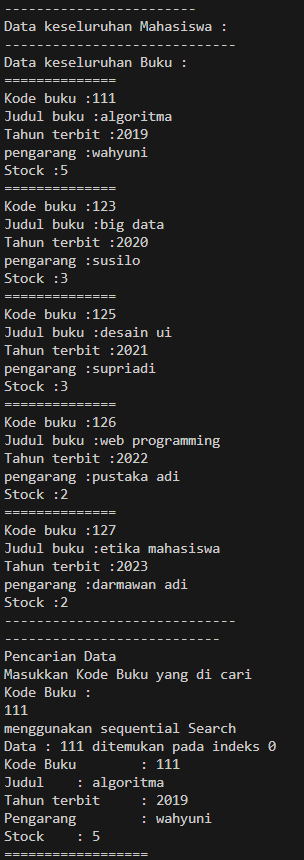
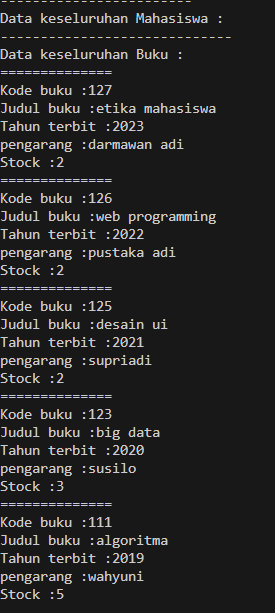
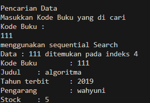
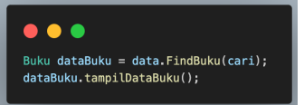
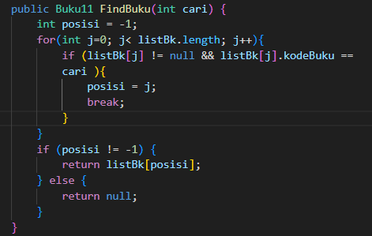
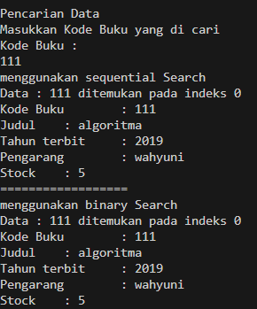
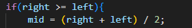
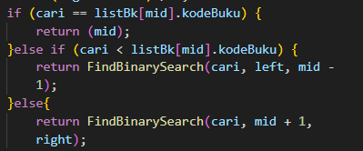
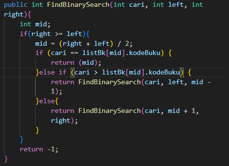
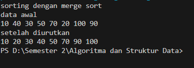

## Laporan Praktikum 7

## 6.2.1 percobaan 1 : Searching/ pencarian menggunakan algoritma Sequential Search

Hasil Running Program:

## 6.2.3 Pertayaan
1. Jelaskan fungsi break yang ada pada method FindSeqSearch!

    Berfungsi untuk menghentikan perulangan
2. Jika Data Kode Buku yang dimasukkan tidak terurut dari kecil ke besar. Apakah program masih dapat berjalan? Apakah hasil yang dikeluarkan benar? Tunjukkan hasil screenshoot untuk bukti dengan kode Buku yang acak. Jelaskan Mengapa hal tersebut bisa terjadi?

3. Buat method baru dengan nama FindBuku menggunakan konsep sequential search dengan tipe method dari FindBuku adalah BukuNoAbsen. Sehingga Anda bisa memanggil method tersebut pada class BukuMain seperti gambar berikut 

## 6.3.1 Percobaan 2: Serching / pencarian menggunakan Binary Search

hasil Running Program

## 6.3.3 Pertayaan
1. Tunjukkan pada kode program yang mana proses divide dijalankan!

2. Tunjukkan pada kode program yang mana proses conquer dijalankan!

4. Jika data Kode Buku yang dimasukkan tidak urut. Apakah program masih dapat berjalan? Mengapa demikian! Tunjukkan hasil screenshoot untuk bukti dengan kode Buku yang acak. Jelaskan Mengapa hal tersebut bisa terjadi? 

    iya, kode program masih berjalan, tapi hasi dari binary search tidak ditemukan karena binary search memerlukan data yang terurut agar dapat ditemukan

3. Jika Kode Buku yang dimasukkan dari Kode Buku terbesar ke terkecil (missal : 20215, 20214,20212, 20211, 20210) dan elemen yang dicari adalah 20210. Bagaimana hasil dari binary search? Apakah sesuai? Jika tidak sesuai maka ubahlah kode program binary seach agar hasilnya sesuai!

    hasil dari binary tidak sesuai karena tidak terurut dari yang terkecil

Hasi modifikasi 

## 6.4.1 Percobaan 3: pengayaan Devide and Conquer

Hasil Running Program:

## 6.5 Latihan Praktikum
1. Modifikasi percobaan searching diatas dengan ketentuan berikut ini
- Ubah tipe data dari kode Buku yang awalnya int menjadi String
- Tambahkan method untuk pencarian kode Buku (bertipe data String) dengan menggunakan 
sequential search dan binary search.
2. Modifikasi percobaan searching diatas dengan ketentuan berikut ini
- Tambahkan method pencarian judul buku menggunakan sequential search dan binary 
search. Sebelum dilakukan searching dengan binary search data harus dilakukan pengurutan 
dengan menggunakan algoritma Sorting (bebas pilih algoritma sorting apapun)! Sehingga 
ketika input data acak, maka algoritma searching akan tetap berjalan
- Buat aturan untuk mendeteksi hasil pencarian judul buku yang lebih dari 1 hasil dalam 
bentuk kalimat peringatan! Pastikan algoritma yang diterapkan sesuai dengan kasus yang 
diberikan!
