## Laporan Praktikum jobsheet 7

## 2.1 Percobaan 1: Penyimpanan Tumpukan Barang dalam Gudang

## 2.1.2 Verifikasi Hasil Percobaan

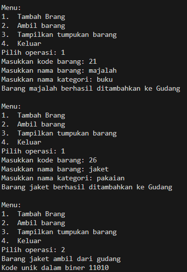
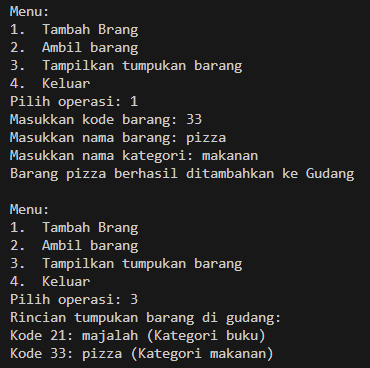

## 2.1.3 Pertanyaan
1. Lakukan perbaikan pada kode program, sehingga keluaran yang dihasilkan sama dengan verifikasi 
hasil percobaan! Bagian mana saja yang perlu diperbaiki?

Bagian yang diperbaiki:

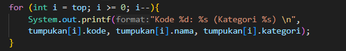

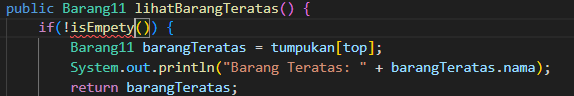

Setelah diperbaiki:

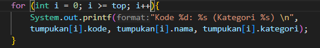

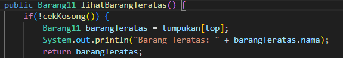

2. Berapa banyak data barang yang dapat ditampung di dalam tumpukan? Tunjukkan potongan kode 
programnya!

    data yang dapat ditampung sebanyak 7
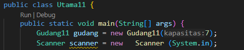

3. Mengapa perlu pengecekan kondisi !cekKosong() pada method tampilkanBarang? Kalau kondisi 
tersebut dihapus, apa dampaknya?

    untuk melakukan pengecekan apakah barang itu tersedia digudang atau tidak,
    jika dihapus maka method tersebut tidak menampilkan apa apa

4. Modifikasi kode program pada class Utama sehingga pengguna juga dapat memilih operasi lihat barang teratas, serta dapat secara bebas menentukan kapasitas gudang!

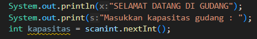
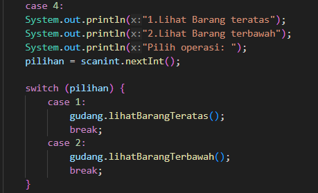
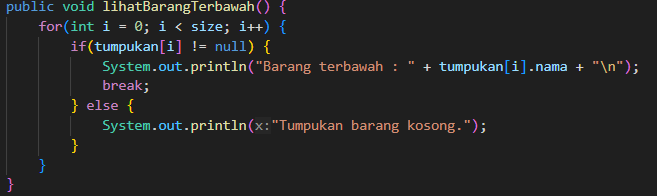

5. Commit dan push kode program ke Github

## 2.2 Percobaan 2: Konversi Kode Barang ke Biner 

## 2.2.2 Verifikasi Hasil Percobaan
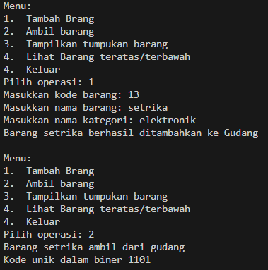

## 2.2.3 Pertanyaan
1. Pada method konversiDesimalKeBiner, ubah kondisi perulangan menjadi while (kode != 0), bagaimana hasilnya? Jelaskan alasannya!

    program masih dapat berjalan karena kode barang yang di hapus bernilai min

2. Jelaskan alur kerja dari method konversiDesimalKeBiner!

    memeriksa apakah angka desimal lebih dari 0; jika iya, lanjutkan ke berikutnya. jika tidak, maka akan mengembaliikan string kosong yang mewakili bilangan biner.
    kemudian menghitung sisa angka desimal saat di bagi dengan 2 lalu nilainya akan di push pada method push di object stack. Setelah itu akan dibagi dengan dua dan perulangan kembali dilakukan sampai nilainya 0 (jika nilainya 0 perulangan berhenti). Lalu program mengecek apakah stack di object kosong atau tidak, jika ada isinya maka tumpukan biner teratas akan dimasukkan pada variabel biner dan program akan me-return nilai dari variabel biner tersebut.

## 2.3 Percobaan 3: Konversi Notasi Infix ke Postfix

## 2.3.2 Verifikasi Hasil Percobaan

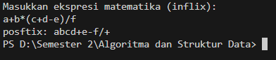

## 2.3.3 Pertanyaan
1. Pada method derajat, mengapa return value beberapa case bernilai sama? Apabila return 
value diubah dengan nilai berbeda-beda setiap case-nya, apa yang terjadi?

    Beberapa case memiliki return value yang sama karena kedudukannya prioritasnya yang setara seperti * dan / (setara). Jika return valuenya diubah dengan nilai berbeda-beda maka kedudukan dari setiap operator akan berbeda-beda yang dimana akan menimbulkan error dalam konversi postfixnya

2. Jelaskan alur kerja method konversi!

    a. Jika adalah operand, maka langsung ditambahkan ke variabel P

    b. Jika c adalah '(', maka ditambahkan ke stack menggunakan method push().

    c. jika c adalah ')', maka semua karakter pada stack ditambahkan pada variabel P sampai '(' ditemukan dan '(' kemudian dihapus dari stack dengan method pop().

    d. jika c adalah operator, maka char operator pada stack dengan kedudukan prioritas yang lebih tinggi ditambah di variabel P sampai char operator yang lebih rendah atau sama ditemukan dan operator tersebut kemudian ditambahkan menggunakan method push().

    e.Setelah semua iterasi selesai, method mereturn nilai pada variabel P

3. Pada method konversi, apa fungsi dari potongan kode berikut?

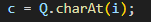

Memasukkan char ke i pada String Q ke dalam variabel c (i sesuai dengan iterasinya dalam perulangan).

## 2.4 Latihan Praktikum
Perhatikan dan gunakan kembali kode program pada Percobaan 1. Tambahkan dua method berikut 

pada class Gudang:

• Method lihatBarangTerbawah digunakan untuk mengecek barang pada tumpukan terbawah

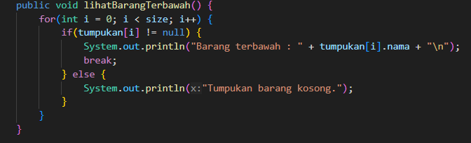

• Method cariBarang digunakan untuk mencari ada atau tidaknya barang berdasarkan kode
barangnya atau nama barangnya

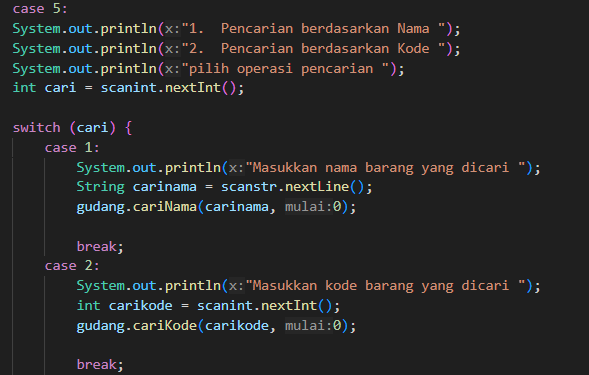

